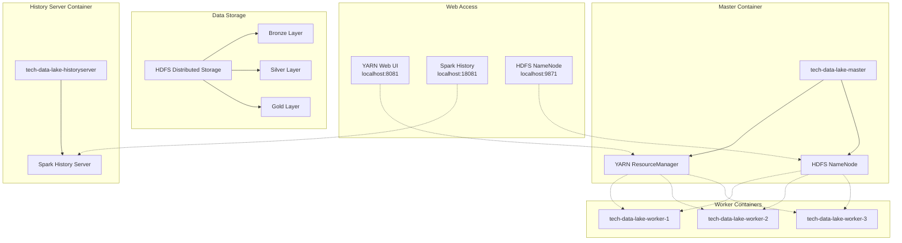
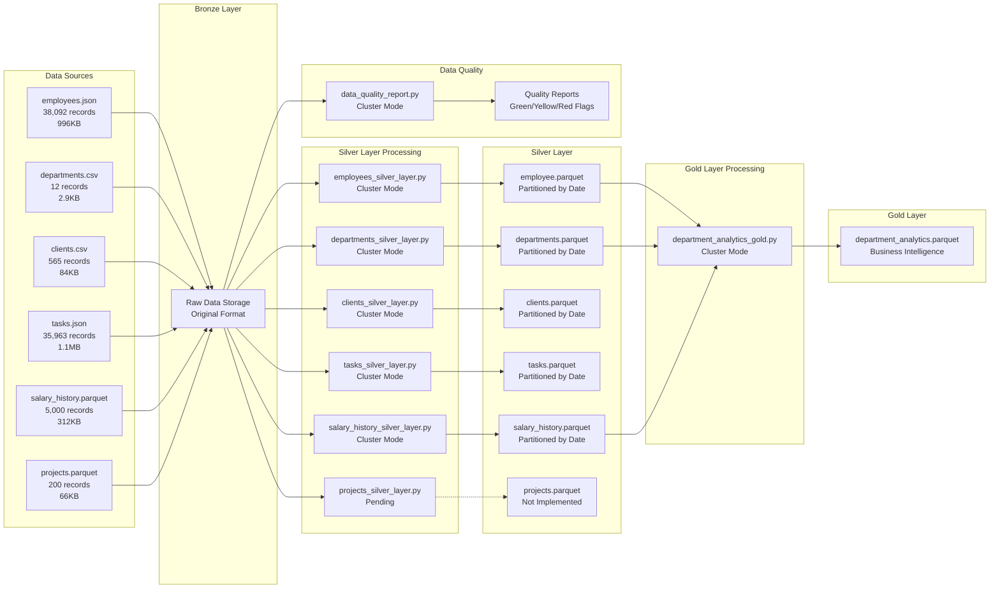
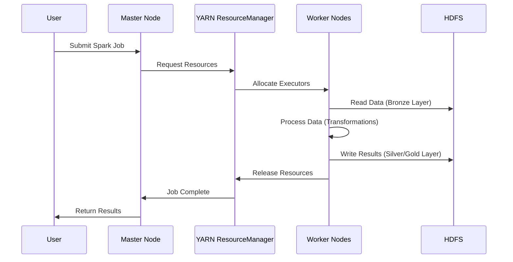

# Tech Data Lake

This project implements a Data Lake using Apache Spark and Hadoop, configured with Docker for easy development and deployment. All jobs run in **cluster mode** with YARN for distributed processing.

## Project Purpose

This project demonstrates a comprehensive **Enterprise Data Lake** implementation using modern big data technologies. It serves as a complete reference architecture for organizations looking to build scalable, production-ready data processing pipelines. The project showcases:

- **Medallion Architecture**: Implementation of Bronze, Silver, and Gold data layers
- **Distributed Processing**: Apache Spark with YARN cluster mode for scalable data processing
- **Data Quality Management**: Automated quality assessment and monitoring systems
- **Production-Ready Logging**: Comprehensive observability and debugging capabilities
- **Containerized Deployment**: Docker-based infrastructure for consistent environments
- **Business Intelligence**: Advanced analytics and insights generation

The project provides a real-world example of how to transform raw business data into actionable insights through a well-structured, scalable data pipeline.

## Target Audience

This project is designed for:

### **Data Engineers & Architects**
- Professionals building enterprise data lakes and data platforms
- Teams implementing medallion architecture patterns
- Engineers working with Apache Spark and Hadoop ecosystems
- Architects designing scalable data processing solutions

### **Data Analysts**
- Teams needing to understand data pipeline implementation
- Analysts requiring clean, processed data for business intelligence

### **DevOps & Platform Engineers**
- Teams managing containerized big data infrastructure
- Engineers implementing monitoring and observability systems
- Professionals working with distributed computing environments

### **Students & Learners**
- Individuals studying big data technologies and architectures
- Students learning Apache Spark, Hadoop, and data engineering concepts
- Professionals transitioning into data engineering roles

### **Organizations**
- Companies implementing their first data lake
- Enterprises scaling existing data processing capabilities
- Organizations requiring production-ready data quality management
- Teams needing reference implementations for best practices

## License

This project is licensed under the **MIT License** - see the [LICENSE](LICENSE) file for details.

The MIT License is a permissive license that allows for:
- Commercial use
- Modification
- Distribution
- Private use

While providing:
- No warranty
- No liability

This license is suitable for educational and commercial purposes, making it ideal for learning projects and enterprise implementations.

## Architecture

The project consists of the following components:

- **Master Node**: Manages the Spark cluster and coordinates operations
- **History Server**: Provides web interface for job monitoring
- **Worker Nodes**: Execute distributed tasks (scalable as needed)

### **Infrastructure Diagram**



### **Container Details**

| Container | Service | Internal Port | External Port | Purpose |
|-----------|---------|---------------|---------------|---------|
| `tech-data-lake-master` | YARN ResourceManager | 8088 | 8081 | Resource management |
| `tech-data-lake-master` | HDFS NameNode | 9870 | 9871 | HDFS metadata |
| `tech-data-lake-master` | HDFS SecondaryNameNode | 9868 | - | HDFS backup |
| `tech-data-lake-master` | SSH Server | 22 | - | Container access |
| `tech-data-lake-historyserver` | Spark History Server | 18080 | 18081 | Job monitoring |
| `tech-data-lake-worker-*` | HDFS DataNode | 9864 | - | Data storage |
| `tech-data-lake-worker-*` | YARN NodeManager | 8042 | - | Local resource management |
| `tech-data-lake-worker-*` | Spark Executor | Dynamic | - | Data processing |

### **Data Flow Diagram**



### **Job Execution Flow**



### **Why This Architecture?**

**Cluster Mode with YARN**: 
- **Scalability**: YARN manages resources dynamically, allowing the cluster to scale up/down based on workload
- **Resource Efficiency**: Prevents resource waste by allocating only what's needed for each job
- **Fault Tolerance**: If a worker node fails, YARN automatically redistributes the workload
- **Production Ready**: This is the standard architecture used in enterprise environments

**Docker Containerization**:
- **Consistency**: Ensures the same environment across development, testing, and production
- **Isolation**: Each component runs in its own container, preventing conflicts
- **Easy Deployment**: Can be deployed anywhere Docker is available
- **Version Control**: Exact versions of all dependencies are locked in the container

## Requirements

- Docker
- Docker Compose
- Git

## Project Structure

```
projeto3/
├── data/                          # Raw data storage and sample datasets
│   ├── employees.json            # Employee data (38,092 records, 996KB)
│   ├── departments.csv           # Department data (12 records, 2.9KB)
│   ├── clients.csv               # Client data (565 records, 84KB)
│   ├── tasks.json                # Task assignments (35,963 records, 1.1MB)
│   ├── salary_history.parquet    # Salary history data (5,000 records, 312KB)
│   ├── projects.parquet          # Project data (200 records, 66KB)
│   └── README.md                 # Data documentation
├── jobs/                          # Spark applications and ETL pipelines
│   ├── bronze_to_silver/         # Bronze to Silver transformations
│   │   ├── employees_silver_layer.py
│   │   ├── departments_silver_layer.py
│   │   ├── clients_silver_layer.py
│   │   ├── tasks_silver_layer.py
│   │   ├── salary_history_silver_layer.py
│   │   ├── projects_silver_layer.py    # Pending implementation
│   │   └── README.md             # Bronze to Silver documentation
│   ├── silver_to_gold/           # Silver to Gold transformations
│   │   ├── department_analytics_gold.py
│   │   └── README.md             # Silver to Gold documentation
│   ├── data_quality/             # Data Quality Assessment
│   │   ├── data_quality_report.py
│   │   └── README.md             # Data quality documentation
│   ├── utils/                    # Utility functions and helpers
│   │   └── README.md             # Utils documentation
│   ├── run_pipeline_1.py         # Main pipeline execution script
│   ├── utils.zip                 # Utilities archive
│   └── README.md                 # Jobs documentation
├── data_processed/               # Processed data output directory
├── yarn/                         # Hadoop/YARN configurations
│   └── README.md                 # YARN configuration documentation
├── ssh/                          # SSH configurations for node communication
│   └── README.md                 # SSH setup documentation
├── requirements/                  # Python dependencies
│   ├── requirements.txt          # Python package requirements
│   └── README.md                 # Requirements documentation
├── test/                         # Test files and test data
│   ├── test_data_quality.py     # Data quality testing
│   ├── test_dataframe_creation.py # DataFrame creation tests
│   ├── test_logging.py          # Logging functionality tests
│   ├── test_schema.py           # Schema validation tests
│   └── .coveragerc              # Coverage configuration
├── .github/                      # GitHub Actions CI/CD
│   └── workflows/
│       └── test.yml             # Automated testing pipeline
├── requirements-dev.txt          # Development dependencies
├── Dockerfile                    # Docker image configuration
├── docker-compose.yml           # Service configuration
├── entrypoint.sh                # Container startup script
├── .gitignore                   # Git ignore patterns
├── README.md                    # Main project documentation
├── CHANGELOG.md                 # Version history and changes
└── LICENSE                      # MIT License
```

## Cluster Mode Implementation

All Spark jobs are designed to run in **cluster mode** with the following characteristics:

- **Self-contained Jobs**: Each job file contains all necessary transformation functions
- **No External Dependencies**: Eliminates import issues in distributed environments
- **YARN Resource Management**: Efficient resource allocation and monitoring
- **Distributed Processing**: Driver runs in separate container managed by YARN

### **Why Cluster Mode?**

**Self-contained Jobs**:
- **Reliability**: No dependency on external modules that might not be available on worker nodes
- **Portability**: Jobs can be moved between environments without worrying about missing imports
- **Debugging**: Easier to troubleshoot when all code is in one place
- **Deployment**: Simpler deployment process - just copy the job file

**No External Dependencies**:
- **Distributed Safety**: In cluster mode, worker nodes might not have access to the same file system as the driver
- **Performance**: Avoids network overhead of transferring additional files
- **Consistency**: Ensures all nodes use exactly the same code version

## HDFS Data Structure

The data lake is organized in layers following the medallion architecture:

### Bronze Layer (Raw Data)
```
/opt/spark/data/bronze_layer/
├── employees.json              # 38,092 employee records (996KB)
├── departments.csv             # 12 department records (2.9KB)
├── clients.csv                 # 565 client records (84KB)
├── tasks.json                  # 35,963 task records (1.1MB)
├── salary_history.parquet      # 5,000 salary records (312KB)
└── projects.parquet            # 200 project records (66KB) - Silver pipeline pending
```

**Why Multiple Formats?**
- **JSON**: Flexible schema for complex nested data (employees, tasks)
- **CSV**: Simple, human-readable format for tabular data (departments, clients)
- **Parquet**: Columnar format optimized for analytics and query performance (salary_history, projects)
- **Schema Evolution**: Different formats allow for different data evolution strategies

### Silver Layer (Transformed & Partitioned Data)
```
/opt/spark/data/silver_layer/
├── employee.parquet/
│   ├── year=0/                   # Filtered data (null dates)
│   ├── year=2024/
│   │   ├── month=1/
│   │   │   └── day=1/
│   │   └── month=2/
│   └── year=2025/
├── departments.parquet/
│   ├── year=0/                   # Filtered data (null dates)
│   ├── year=2024/
│   └── year=2025/
├── clients.parquet/
│   ├── year=0/                   # Filtered data (null dates)
│   ├── year=2024/
│   └── year=2025/
├── tasks.parquet/
│   ├── year=0/                   # Filtered data (null dates)
│   ├── year=2024/
│   │   ├── month=8/
│   │   │   ├── day=1/
│   │   │   ├── day=2/
│   │   │   └── ...
│   │   └── month=9/
│   └── year=2025/
│       ├── month=1/
│       ├── month=2/
│       ├── month=3/
│       ├── month=4/
│       └── month=5/
└── salary_history.parquet/
    ├── year=0/                   # Filtered data (null dates)
    ├── year=2024/
    └── year=2025/
```

**Why This Partitioning Strategy?**

**Time-based Partitioning**:
- **Query Performance**: Queries filtering by date can skip irrelevant partitions
- **Data Lifecycle**: Easy to implement data retention policies (delete old partitions)
- **Incremental Processing**: Process only new data by targeting specific date partitions
- **Parallel Processing**: Multiple partitions can be processed simultaneously

**Year=0 Partition**:
- **Data Quality**: Isolates records with invalid dates for separate analysis
- **Audit Trail**: Maintains all original data while flagging quality issues
- **Recovery**: Allows fixing and reprocessing problematic records
- **Compliance**: Ensures no data is lost during the cleaning process

**Parquet Format**:
- **Compression**: Significantly reduces storage costs (up to 80% compression)
- **Columnar Storage**: Optimized for analytical queries that read specific columns
- **Schema Evolution**: Supports adding/removing columns without breaking existing queries
- **Predicate Pushdown**: Spark can push filters to the storage level for better performance

### Gold Layer (Business Intelligence & Analytics)
```
/opt/spark/data/gold_layer/
├── department_analytics.parquet/
│   ├── region=Central/
│   │   ├── department_name=Engineering/
│   │   │   ├── hire_year=2020/
│   │   │   ├── hire_year=2021/
│   │   │   └── hire_year=2022/
│   │   └── department_name=Marketing/
│   └── region=South/
│       ├── department_name=Sales/
│       └── department_name=DevOps/
```

**Why Business-focused Partitioning?**

**Multi-dimensional Partitioning**:
- **Analytical Queries**: Optimized for business questions like "Show me Engineering performance by region and hire year"
- **Drill-down Capability**: Supports hierarchical analysis (region → department → year)
- **Performance**: Pre-aggregated data reduces query time for common business questions
- **Scalability**: Can handle complex analytical workloads efficiently

**Analytics Foundation**:
- **Pre-aggregated Data**: Common business metrics are pre-calculated for faster queries
- **Structured for Analysis**: Data is organized to support typical business questions
- **Performance Optimized**: Partitioning and format choices enable efficient analytical queries
- **Extensible Design**: Structure supports adding new analytical dimensions as needed

### Data Quality Layer (Quality Assessment & Monitoring)
```
/opt/spark/data/bronze_layer/data_quality/
├── data_quality_report/
│   ├── _SUCCESS
│   ├── flag=Green/           # High quality data (0-10% missing values)
│   ├── flag=Yellow/          # Medium quality data (10-30% missing values)
│   └── flag=Red/             # Low quality data (>30% missing values)
```

**Why Flag-based Quality Assessment?**

**Traffic Light System**:
- **Visual Clarity**: Green/Yellow/Red provides immediate visual feedback on data quality
- **Actionable Insights**: Clear thresholds help determine appropriate actions
- **Automated Monitoring**: Can trigger alerts based on quality flags
- **Business Communication**: Non-technical stakeholders can easily understand data quality status

**Partitioned by Quality**:
- **Selective Processing**: Can prioritize high-quality data for critical processes
- **Quality-based Routing**: Different quality levels can be processed differently
- **Historical Tracking**: Monitor quality trends over time
- **Compliance**: Maintain audit trail of data quality assessments

### Data Quality Handling:
- **Year 0 Partition**: Contains records with null or invalid dates
- **Default Values**: Null dates are set to "0000-01-01" and partitioned as year=0
- **Data Integrity**: Allows identification and processing of problematic records
- **Audit Trail**: Maintains original data while flagging quality issues

### Key Features:
- **Partitioning**: Data is partitioned by year/month/day and by region/department/hire year for optimal query performance
- **Data Quality**: Null values are handled with appropriate defaults
- **Transformations**: Self-contained transformation functions in each job
- **Format**: Parquet format for efficient storage and querying
- **Cluster Mode**: All jobs run in distributed mode with YARN
- **Business Intelligence**: Gold layer provides aggregated analytics and insights
- **Quality Monitoring**: Automated data quality assessment with flag-based partitioning
- **Comprehensive Logging**: Professional logging system with decorators for observability and debugging
- **Performance Monitoring**: Automatic execution time tracking and record counting
- **Production Ready**: Enterprise-grade logging for production environments

### **Why These Design Decisions?**

**Decorator-based Logging**:
- **Separation of Concerns**: Logging logic is separated from business logic
- **Consistency**: All functions use the same logging format and behavior
- **Maintainability**: Easy to modify logging behavior across all functions
- **Performance**: Minimal overhead with automatic timing and record counting

**Self-contained Transformations**:
- **Testability**: Each transformation can be tested independently
- **Reusability**: Transformations can be reused across different jobs
- **Debugging**: Easier to isolate and fix issues in specific transformations
- **Documentation**: Each function has a clear, single responsibility

### Data Quality System:
- **Quality Assessment**: Analyzes missing values across all columns in all data sources
- **Quality Flags**: 
  - **Green**: 0-10% missing values (high quality)
  - **Yellow**: 10-30% missing values (medium quality)
  - **Red**: >30% missing values (low quality)
- **Partitioned Reports**: Quality reports are partitioned by flag for easy analysis
- **Multi-Format Support**: Handles CSV, JSON, and Parquet files
- **Comprehensive Coverage**: Analyzes all 6 data sources (departments, clients, employees, tasks, salary_history, projects)
- **Note**: Projects data exists in Bronze layer but Silver layer processing pipeline is pending implementation

## Documentation

This project includes comprehensive documentation for each component:

### **Component Documentation**
- **Data Layer**: `data/README.md` - Raw data structure and format descriptions
- **Bronze to Silver**: `jobs/bronze_to_silver/README.md` - ETL transformation details
- **Silver to Gold**: `jobs/silver_to_gold/README.md` - Analytics and aggregation processes
- **Data Quality**: `jobs/data_quality/README.md` - Quality assessment methodology
- **Jobs Overview**: `jobs/README.md` - Complete pipeline documentation
- **Requirements**: `requirements/README.md` - Dependencies and setup instructions
- **YARN Configuration**: `yarn/README.md` - Hadoop/YARN configuration details
- **SSH Configuration**: `ssh/README.md` - SSH setup for node communication
- **Utils**: `jobs/utils/README.md` - Utility functions and helpers


### **Project Documentation**
- **Main Guide**: `README.md` - This comprehensive project overview
- **Version History**: `CHANGELOG.md` - Complete change tracking and version history
- **License**: `LICENSE` - MIT License terms and conditions

## How to Use

1. Clone the repository:
```bash
git clone https://github.com/matheuspassini/Tech-Company-Big-Data.git
cd projeto3
```

2. Start the cluster with the desired number of workers:
```bash
docker-compose -p tech-data-lake -f docker-compose.yml up -d --scale worker=3
```

3. Run the complete pipeline (cluster mode):
```bash
docker exec tech-data-lake-master python3 /opt/spark/apps/run_pipeline_1.py
```

4. Run individual jobs (cluster mode):
```bash
# Silver Jobs
# Employees job
docker exec tech-data-lake-master spark-submit --master yarn --deploy-mode cluster /opt/spark/apps/bronze_to_silver/employees_silver_layer.py

# Departments job
docker exec tech-data-lake-master spark-submit --master yarn --deploy-mode cluster /opt/spark/apps/bronze_to_silver/departments_silver_layer.py

# Clients job
docker exec tech-data-lake-master spark-submit --master yarn --deploy-mode cluster /opt/spark/apps/bronze_to_silver/clients_silver_layer.py

# Tasks job
docker exec tech-data-lake-master spark-submit --master yarn --deploy-mode cluster /opt/spark/apps/bronze_to_silver/tasks_silver_layer.py

# Salary History job
docker exec tech-data-lake-master spark-submit --master yarn --deploy-mode cluster /opt/spark/apps/bronze_to_silver/salary_history_silver_layer.py

# Gold Jobs
# Department Analytics job
docker exec tech-data-lake-master spark-submit --master yarn --deploy-mode cluster /opt/spark/apps/silver_to_gold/department_analytics_gold.py

# Data Quality Jobs
# Data Quality Report job
docker exec tech-data-lake-master spark-submit --master yarn --deploy-mode cluster /opt/spark/apps/data_quality/data_quality_report.py

5. Monitor jobs and access web interfaces:
- **YARN Web UI**: http://localhost:8081
- **Spark History Server**: http://localhost:18081

6. Monitor applications in real-time:
```bash
# Monitor YARN applications with watch (real-time updates every 3 seconds)
watch -n 3 'docker exec tech-data-lake-master yarn application -list'

# Monitor specific application logs
docker exec tech-data-lake-master yarn logs -applicationId <application_id>
```

7. View job logs:
```bash
# List applications
docker exec tech-data-lake-master yarn application -list

# View logs for specific application
docker exec tech-data-lake-master yarn logs -applicationId <application_id>
```

## Testing

The project includes a comprehensive test suite to ensure code quality and reliability:

### **Running Tests Locally:**
```bash
# Start the cluster
docker-compose -p tech-data-lake -f docker-compose.yml up -d --scale worker=3

# Run all tests with coverage
docker exec tech-data-lake-master python -m pytest /opt/spark/test/ --cov=utils --cov-report=html

# Run specific test file
docker exec tech-data-lake-master python -m pytest /opt/spark/test/test_data_quality.py -v

# Run tests with verbose output
docker exec tech-data-lake-master python -m pytest /opt/spark/test/ -v
```

### **Test Categories:**
- **Data Quality Tests**: Test data quality assessment functions
- **DataFrame Creation Tests**: Test DataFrame creation and schema validation
- **Logging Tests**: Test logging functionality and decorators
- **Schema Tests**: Test data type handling and schema validation

### **Test Coverage:**
- **Current Coverage**: 61% (9 tests passing)
- **Minimum Required**: 60%
- **Coverage Reports**: Available in HTML format
- **Coverage Location**: `htmlcov/index.html` after test execution

### **CI/CD Integration:**
- **Automated Testing**: Tests run automatically on every push and pull request
- **Quality Gates**: Build fails if coverage drops below 60%
- **Artifact Generation**: Test reports and coverage data available for download
- **Fast Feedback**: Immediate notification of test failures or quality issues

## Logging System
The project implements a comprehensive logging system using Python decorators for enhanced observability and debugging:

### **Logging Features:**
- **Decorator-based Logging**: `@log_execution` decorator applied to all transformation functions
- **Execution Timing**: Automatic measurement of function execution time
- **Record Counting**: Automatic counting of records processed by each function
- **Structured Logs**: Consistent log format with timestamps and log levels
- **Docker-friendly**: Logs output to console for easy container monitoring

### **Log Format:**
```
2024-01-15 10:30:15,123 - __main__ - INFO - Starting execution of clean_null_dates
2024-01-15 10:30:16,456 - __main__ - INFO - Function clean_null_dates processed 1000 records
2024-01-15 10:30:17,789 - __main__ - INFO - Function clean_null_dates completed in 1.23 seconds
```

### **Benefits:**
- **Observability**: Complete visibility into ETL pipeline execution
- **Performance Monitoring**: Track execution time of each transformation
- **Data Quality**: Monitor record counts and data processing
- **Debugging**: Easy identification of bottlenecks and issues
- **Production Ready**: Professional logging for production environments

## Job Execution Details

- **Deploy Mode**: All jobs run in `cluster` mode
- **Master**: YARN resource manager
- **Driver**: Runs in separate container managed by YARN
- **Executors**: Distributed across worker nodes
- **Logs**: Available through YARN logs command and comprehensive Python logging
- **Monitoring**: Real-time tracking via YARN Web UI

## Performance Benefits

- **Distributed Processing**: Workload spread across multiple nodes
- **Resource Optimization**: Dynamic resource allocation via YARN
- **Scalability**: Easy to add/remove worker nodes
- **Fault Tolerance**: Automatic recovery from node failures
- **Monitoring**: Comprehensive job tracking and metrics
- **Business Intelligence**: Advanced analytics and insights in Gold layer

## CI/CD Pipeline

The project includes a comprehensive CI/CD pipeline using GitHub Actions for automated testing and quality assurance:

### **Pipeline Features:**
- **Automated Testing**: Runs on every push and pull request
- **Code Quality Checks**: Linting with flake8 and black
- **Security Scanning**: Automated security analysis with bandit
- **Test Coverage**: Minimum 60% coverage requirement with detailed reports
- **Docker Integration**: Tests run in the same containerized environment as production
- **Artifact Generation**: Test reports and coverage data available for download

### **Pipeline Workflow:**
1. **Code Checkout**: Retrieves latest code from repository
2. **Environment Setup**: Configures Python and Docker environments
3. **Code Quality**: Runs linting and formatting checks
4. **Security Scan**: Performs automated security analysis
5. **Test Execution**: Runs comprehensive test suite with coverage
6. **Artifact Upload**: Generates and uploads test reports
7. **Cleanup**: Stops containers and cleans up resources

### **Quality Gates:**
- **Test Coverage**: Minimum 60% code coverage required
- **Code Quality**: All linting checks must pass
- **Security**: No high-severity security issues allowed
- **Test Results**: All tests must pass successfully

### **Development Workflow:**
- **Local Development**: Use existing Docker setup for local testing
- **Continuous Integration**: Automated testing on every code change
- **Quality Assurance**: Automated quality checks prevent regressions
- **Feedback Loop**: Immediate feedback on code quality and test results

### **Monitoring and Reports:**
- **Test Results**: Detailed test execution reports
- **Coverage Reports**: HTML coverage reports with line-by-line analysis
- **Security Reports**: JSON security analysis reports
- **Build Logs**: Complete execution logs for debugging

### **Benefits:**
- **Reliability**: Automated testing ensures code quality
- **Efficiency**: Fast feedback on code changes
- **Consistency**: Same testing environment across development and CI
- **Transparency**: Clear visibility into code quality and test coverage
- **Maintainability**: Automated quality gates reduce technical debt